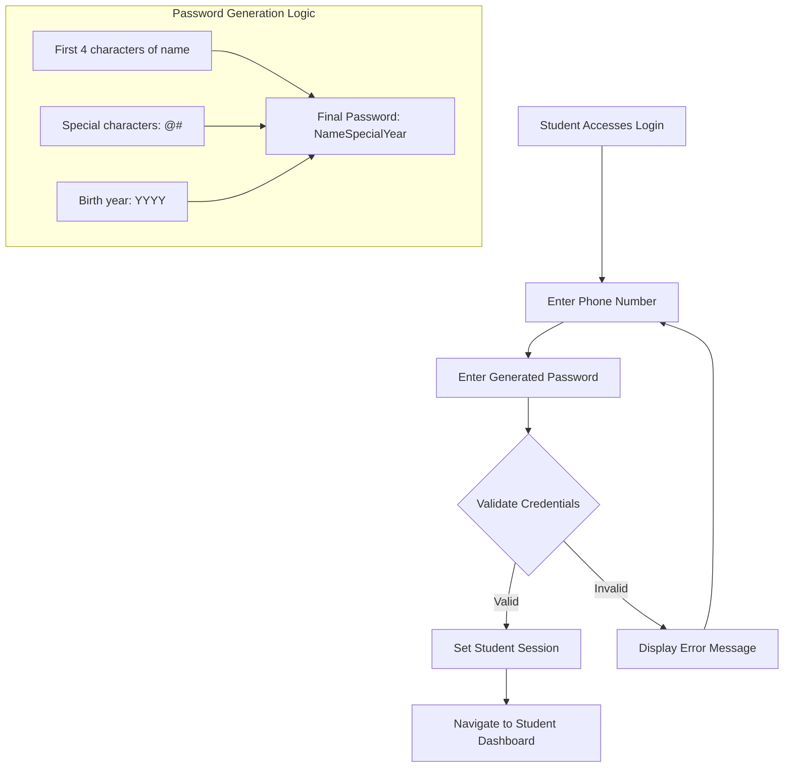
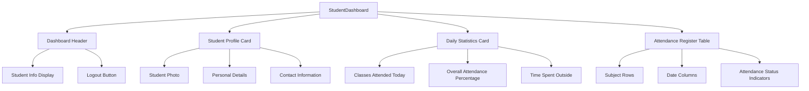
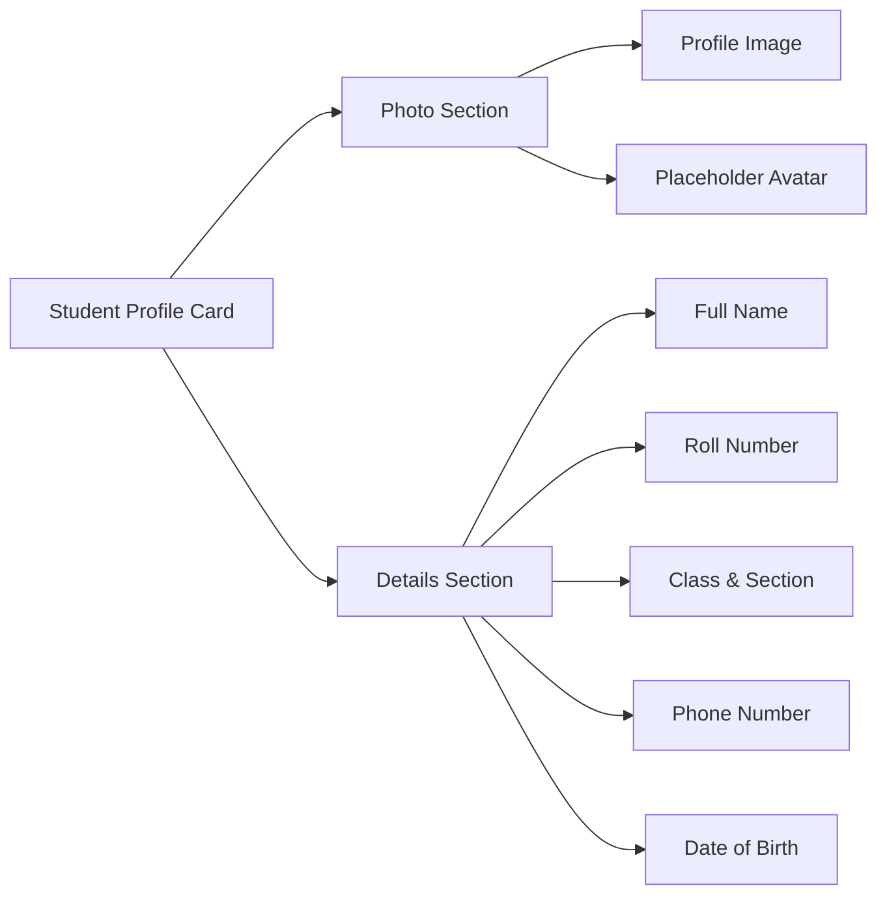
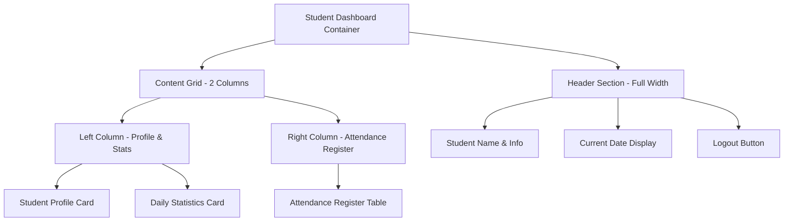
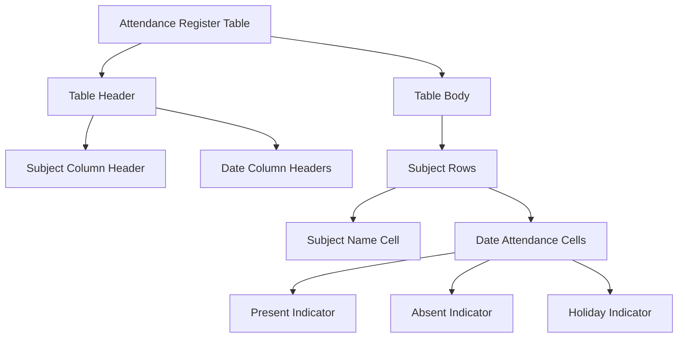
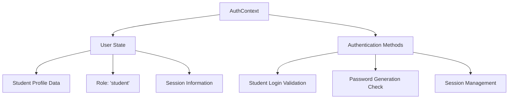
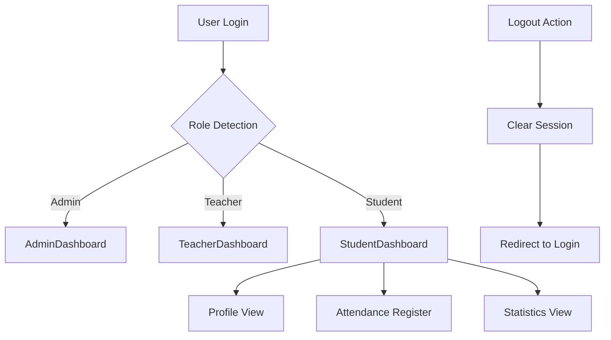

# Student Dashboard Implementation Design

## Overview

The Student Dashboard is a comprehensive web interface that allows students to access their academic information, attendance records, and daily statistics after secure authentication. The system integrates with the existing authentication framework and provides a dedicated student experience with personalized data visualization and attendance tracking capabilities.

**Core Value Proposition**: Empowering students with real-time access to their academic progress, attendance patterns, and daily engagement metrics through an intuitive and responsive dashboard interface.

## Technology Stack & Dependencies

| Component | Technology | Purpose |
|-----------|------------|---------|
| Frontend Framework | React 18 with TypeScript | Component-based UI development |
| State Management | React Context API | Authentication and global state |
| UI Component Library | shadcn/ui with Tailwind CSS | Consistent design system |
| Routing | React Router v6 | Client-side navigation |
| Icons | Lucide React | Consistent iconography |
| Date Handling | date-fns | Date formatting and calculations |
| Notifications | Sonner | Toast notifications |
| Build Tool | Vite | Development and build process |

## Authentication Architecture

### Student Authentication Flow



### Authentication Data Model

| Field | Type | Description | Example |
|-------|------|-------------|---------|
| phoneNumber | string | Student's registered phone number | "9876543210" |
| password | string | Generated password format | "Arjn@#2005" |
| role | string | User role identifier | "student" |
| studentId | number | Unique student identifier | 1001 |

### Password Generation Strategy

The student password follows a specific algorithmic pattern:
- **Name Component**: First 4 characters of the student's first name (case-sensitive)
- **Special Characters**: Fixed sequence "@#"
- **Year Component**: Student's birth year in YYYY format
- **Example**: For "Arjun Sharma" born in 2005 → "Arjn@#2005"

## Component Architecture

### Student Dashboard Structure



### Component Hierarchy

| Component | Purpose | Props Interface |
|-----------|---------|-----------------|
| StudentDashboard | Main dashboard container | None (uses auth context) |
| StudentProfileCard | Display student personal information | studentData: StudentProfile |
| DailyStatsCard | Show daily attendance metrics | dailyStats: DailyStatistics |
| AttendanceRegisterTable | Display subject-wise attendance grid | attendanceData: AttendanceRecord[] |
| StudentHeader | Navigation and user info | student: StudentInfo |

### Student Profile Card Design



## Data Models & State Management

### Student Profile Data Structure

| Field | Type | Required | Description |
|-------|------|----------|-------------|
| id | number | Yes | Unique student identifier |
| firstName | string | Yes | Student's first name |
| lastName | string | Yes | Student's last name |
| rollNumber | string | Yes | Class roll number |
| classId | number | Yes | Class identifier |
| section | string | Yes | Class section |
| phoneNumber | string | Yes | Contact phone number |
| dateOfBirth | Date | Yes | Birth date for age calculation |
| profilePhoto | string | No | Photo URL or base64 |
| address | string | No | Residential address |

### Daily Statistics Model

| Metric | Type | Calculation Method | Display Format |
|--------|------|-------------------|----------------|
| classesAttendedToday | number | Count of present subjects for current date | "5 out of 6 classes" |
| overallPercentage | number | (Total present days / Total school days) × 100 | "85.5%" |
| timeSpentOutside | string | Duration calculation from entry/exit logs | "2h 30m" |
| todayStatus | enum | Overall status for current day | "Present" / "Absent" / "Partial" |

### Attendance Record Structure

| Field | Type | Description |
|-------|------|-------------|
| subjectId | number | Subject identifier |
| subjectName | string | Subject display name |
| teacherName | string | Subject teacher |
| dateAttendance | Record<string, AttendanceStatus> | Date-wise attendance map |
| totalClasses | number | Total classes conducted |
| attendedClasses | number | Classes attended by student |
| attendancePercentage | number | Subject-wise attendance percentage |

### Attendance Status Enumeration

| Status | Value | Display Color | Icon |
|--------|-------|---------------|------|
| Present | "P" | Green (#22c55e) | CheckCircle |
| Absent | "A" | Red (#ef4444) | XCircle |
| Late | "L" | Orange (#f59e0b) | Clock |
| Holiday | "H" | Gray (#6b7280) | Calendar |

## Student Dashboard Layout Design

### Main Dashboard Grid Layout



### Responsive Breakpoints

| Screen Size | Layout Behavior | Grid Configuration |
|-------------|-----------------|-------------------|
| Desktop (>1024px) | Two-column layout | 1fr 2fr grid ratio |
| Tablet (768-1024px) | Two-column collapsed | 1fr 1fr grid ratio |
| Mobile (<768px) | Single column stack | Full-width stacking |

## Attendance Register Table Architecture

### Table Structure Design



### Date Range Generation Logic

The attendance table displays a monthly view with the following date generation strategy:

1. **Current Month Focus**: Default to current month on page load
2. **Month Navigation**: Allow month selection via dropdown
3. **Date Filtering**: Include only school days (exclude weekends and holidays)
4. **Dynamic Column Generation**: Create columns based on selected month's date range

### Subject-wise Attendance Display

| Subject | Teacher | Total Classes | Attended | Percentage | Date Cells (Dynamic) |
|---------|---------|---------------|----------|------------|---------------------|
| Mathematics | Dr. Smith | 22 | 20 | 91% | P/A/L indicators per date |
| Physics | Prof. Johnson | 20 | 18 | 90% | P/A/L indicators per date |
| Chemistry | Ms. Davis | 21 | 19 | 90.5% | P/A/L indicators per date |

## Daily Statistics Calculation Logic

### Classes Attended Today Algorithm

```mermaid
flowchart TD
    A[Get Current Date] --> B[Fetch Today's Schedule]
    B --> C[Count Total Subjects for Today]
    C --> D[Count Subjects Marked Present]
    D --> E[Calculate Attendance Ratio]
    E --> F[Display: "X out of Y classes"]
    
    G[Handle Edge Cases] --> H[No Classes Today]
    G --> I[Partial Day Attendance]
    G --> J[Holiday Detection]
```

### Overall Percentage Calculation

The overall attendance percentage is calculated using the following methodology:

1. **Total School Days**: Count all non-holiday weekdays from academic year start
2. **Present Days**: Sum all days where student was marked present for majority of subjects
3. **Percentage Formula**: (Present Days ÷ Total School Days) × 100
4. **Real-time Updates**: Recalculate whenever new attendance data is recorded

### Time Outside Tracking

| Metric | Data Source | Calculation Method |
|--------|-------------|-------------------|
| Entry Time | Gate entry logs | First entry timestamp of the day |
| Exit Time | Gate exit logs | Last exit timestamp of the day |
| Break Duration | Movement logs | Sum of time outside classroom during breaks |
| Total Outside Time | Combined calculation | Break duration + non-class periods |

## State Management Architecture

### Authentication Context Integration

The student dashboard integrates with the existing AuthContext with the following enhancements:



### Local State Management Strategy

| State Category | Management Approach | Update Triggers |
|----------------|-------------------|-----------------|
| Student Profile | Context + Local Storage | Login success, profile updates |
| Daily Statistics | Component State | Real-time data fetch, date change |
| Attendance Data | Component State | Month selection, data refresh |
| UI Preferences | Local Storage | User interactions, theme changes |

## Routing & Navigation Integration

### Route Configuration Enhancement

The existing routing system requires modification to support the student dashboard:

| Route Path | Component | Access Control | Redirect Logic |
|------------|-----------|----------------|----------------|
| /student-dashboard | StudentDashboard | Student role only | From dashboard router |
| /login | LoginPage | Public access | Enhanced for student credentials |
| /dashboard | DashboardRouter | Role-based routing | Student → StudentDashboard |

### Navigation Flow Update



## API Integration Layer

### Data Fetching Strategy

| Data Type | Fetch Frequency | Caching Strategy |
|-----------|----------------|------------------|
| Student Profile | On login + manual refresh | Session storage |
| Daily Statistics | Real-time + hourly updates | Memory cache |
| Attendance Records | On month change | Browser cache |
| Subject Schedule | Daily at start | Local storage |

### Mock Data Structure for Development

The system initially uses hardcoded mock data following these structures:

1. **Student Mock Data**: Predefined student profiles with generated credentials
2. **Attendance Mock Data**: Sample attendance records for demonstration
3. **Subject Mock Data**: Standard curriculum subjects with teacher assignments
4. **Statistics Mock Data**: Calculated metrics based on mock attendance

## Testing Strategy

### Component Testing Approach

| Component | Test Categories | Key Scenarios |
|-----------|----------------|---------------|
| StudentDashboard | Integration, Rendering | Role-based access, data loading |
| StudentProfileCard | Unit, Visual | Profile data display, image handling |
| DailyStatsCard | Unit, Logic | Calculation accuracy, edge cases |
| AttendanceRegisterTable | Unit, Interaction | Table rendering, month navigation |

### Authentication Testing

1. **Valid Credentials**: Test successful login with generated passwords
2. **Invalid Credentials**: Verify error handling for wrong credentials
3. **Role Validation**: Ensure student-only access to student dashboard
4. **Session Management**: Test logout and session expiration handling

### Data Flow Testing

1. **Profile Loading**: Verify student data populates correctly
2. **Statistics Calculation**: Test daily metrics computation accuracy
3. **Attendance Display**: Validate attendance table data integrity
4. **Responsive Design**: Test layout adaptation across device sizes

## Security Considerations

### Student Data Protection

| Security Aspect | Implementation Strategy |
|-----------------|------------------------|
| Password Security | Generated passwords with complexity rules |
| Session Management | Secure token storage and expiration |
| Data Encryption | Sensitive data encryption in transit |
| Access Control | Role-based component rendering |

### Privacy Measures

1. **Data Minimization**: Display only student's own data
2. **Secure Storage**: Use encrypted local storage for session data
3. **Audit Logging**: Log student access and actions for security
4. **Input Validation**: Sanitize all user inputs and form data

This design document provides the foundation for implementing a comprehensive student dashboard that integrates seamlessly with the existing school attendance system while providing students with personalized access to their academic information and attendance records.